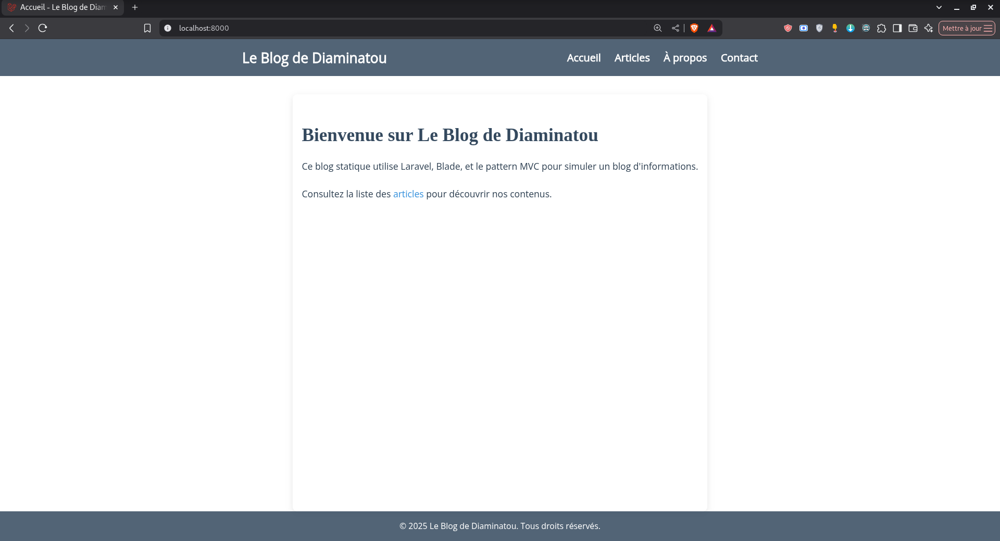
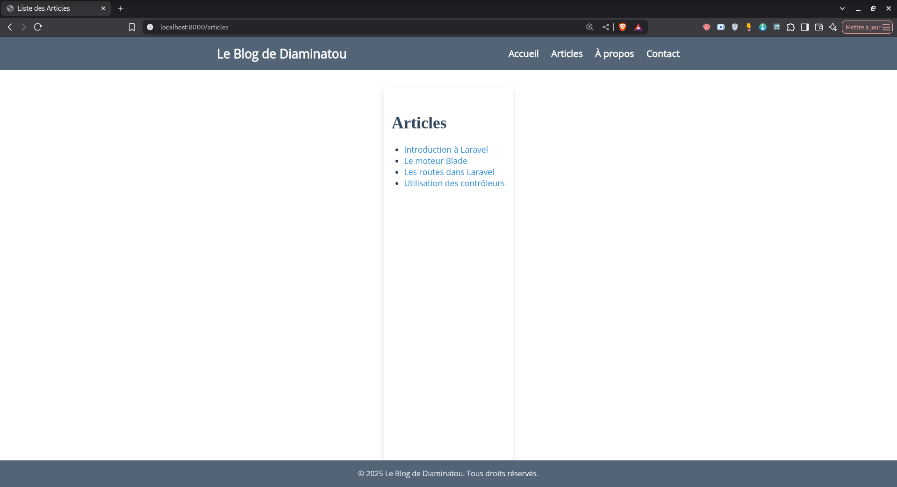
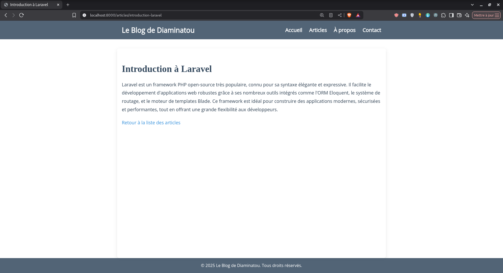
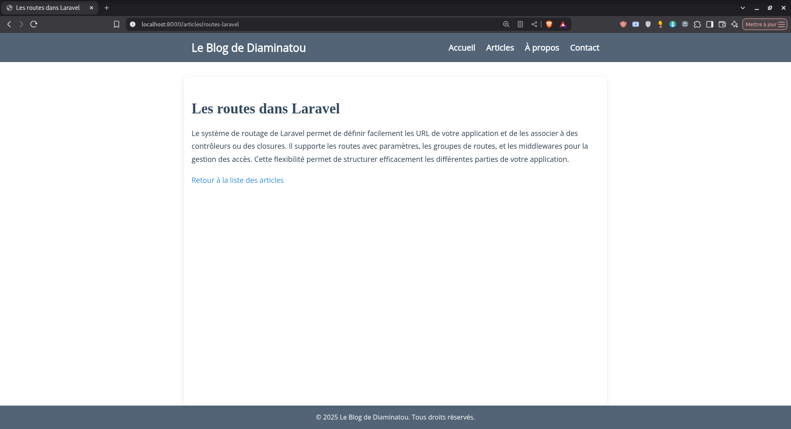
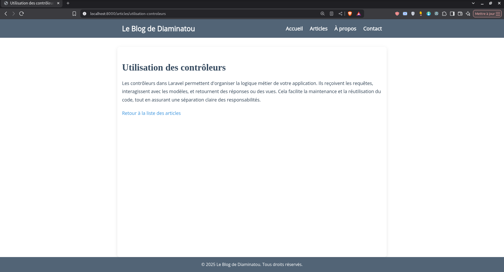
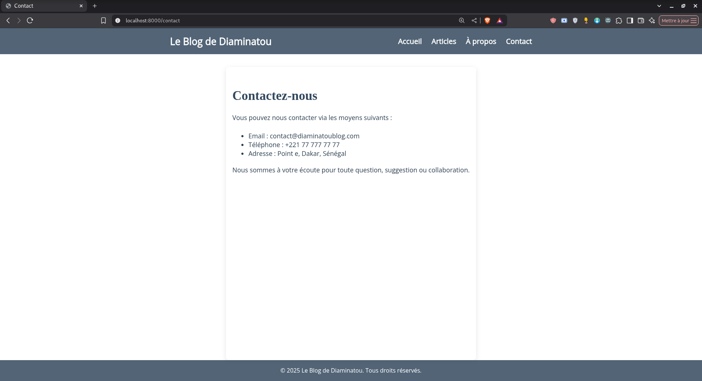
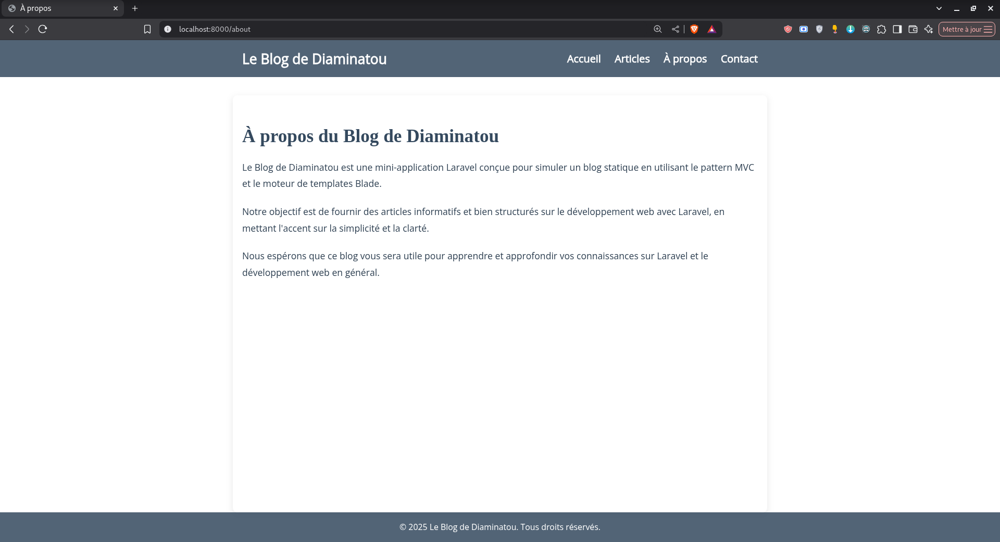

# Blog Statique Laravel - instructions d'installation et URL

## Introduction

Ce projet est une application web développée avec le framework PHP Laravel, implémentant un blog statique sans base de données. Conçu comme travail pratique, il démontre l'utilisation des concepts MVC (Modèle-Vue-Contrôleur), du moteur de templates Blade et du système de routing de Laravel.

    URL d'accès : http://localhost:8000/articles  
    (commande pour lancer le serveur : `php artisan serve`)

---

## Configuration Initiale

### Prérequis Système

- PHP 8.0 ou supérieur (Télécharger PHP)  
- Composer (Installation Composer)  
- Laravel 9.x  
- Node.js (optionnel pour les assets)  

### Installation Pas à Pas

#### Clonage du dépôt :

    git clone https://github.com/diams45588/MonBlog.git
    cd MonBlog

#### Installation des dépendances

    composer install
    npm install  # Si utilisation de frontend assets

#### Configuration de l'environnement

    cp .env.example .env
    php artisan key:generate

#### Modification importante dans `.env` (déjà faite dans le fichier) :

    SESSION_DRIVER=file  # Modification depuis 'database' pour éviter la configuration DB
    APP_URL=http://localhost:8000

#### Démarrage du serveur

    php artisan serve --port=8000

L'application sera accessible à l'adresse: [http://localhost:8000](http://localhost:8000)

---

## Architecture du Projet

### Structure des Fichiers

    blog-laravel/
    ├── app/
    │   └── Http/
    │       └── Controllers/
    │           └── ArticleController.php
    ├── config/
    │   └── session.php  # Configuration des sessions
    ├── public/
    │   └── images/
    │       └── blog_laravel.jpg  # Image utilisée dans le projet
    ├── resources/
    │   └── views/
    │       ├── layouts/
    │       │   └── app.blade.php  # Template principal avec styles inline
    │       ├── articles/
    │       │   ├── index.blade.php  # Liste des articles
    │       │   └── show.blade.php  # Détail d'un article
    │       ├── errors/
    │       │   └── 404.blade.php  # Page d'erreur personnalisée
    │       ├── welcome.blade.php  # Page d'accueil
    │       ├── contact.blade.php  # Page contact
    │       └── about.blade.php    # Page à propos
    ├── routes/
    │   └── web.php  # Définition des routes
    ├── storage/
    │   └── ...  # Dossiers de cache, logs, sessions, etc.
    ├── .env  # Configuration environnement

---

## Fonctionnalités Techniques

### 1. Système de Routing

**Fichier `routes/web.php` :**

    <?php
    
    use Illuminate\Support\Facades\Route;
    use App\Http\Controllers\ArticleController;
    
    Route::get('/articles', [ArticleController::class, 'index']);
    Route::get('/articles/{slug}', [ArticleController::class, 'show']);
    
    Route::get('/', function () {
        return view('welcome');
    });
    
    Route::view('/contact', 'contact')->name('contact');
    Route::view('/about', 'about')->name('about');

### 2. Contrôleur des Articles

**Fichier `app/Http/Controllers/ArticleController.php` :**

    <?php
    
    namespace App\Http\Controllers;
    
    use Illuminate\Http\Request;
    
    class ArticleController extends Controller
    {
        public function index() {
            $articles = [
                [
                    'title' => 'Introduction à Laravel',
                    'slug' => 'introduction-laravel',
                    'content' => 'Laravel est un framework PHP open-source très populaire, connu pour sa syntaxe élégante et expressive. Il facilite le développement d\'applications web robustes grâce à ses nombreux outils intégrés comme l\'ORM Eloquent, le système de routage, et le moteur de templates Blade. Ce framework est idéal pour construire des applications modernes, sécurisées et performantes, tout en offrant une grande flexibilité aux développeurs.'
                ],
                [
                    'title' => 'Le moteur Blade',
                    'slug' => 'moteur-blade',
                    'content' => 'Blade est le moteur de templates officiel de Laravel. Il permet de créer des vues dynamiques avec une syntaxe simple et puissante, facilitant la séparation de la logique et de la présentation. Blade supporte les layouts, les sections, les composants, et bien plus. Grâce à Blade, le développement front-end devient plus rapide et plus organisé, ce qui améliore la maintenabilité du code.'
                ],
                [
                    'title' => 'Les routes dans Laravel',
                    'slug' => 'routes-laravel',
                    'content' => 'Le système de routage de Laravel permet de définir facilement les URL de votre application et de les associer à des contrôleurs ou des closures. Il supporte les routes avec paramètres, les groupes de routes, et les middlewares pour la gestion des accès. Cette flexibilité permet de structurer efficacement les différentes parties de votre application.'
                ],
                [
                    'title' => 'Utilisation des contrôleurs',
                    'slug' => 'utilisation-controleurs',
                    'content' => 'Les contrôleurs dans Laravel permettent d\'organiser la logique métier de votre application. Ils reçoivent les requêtes, interagissent avec les modèles, et retournent des réponses ou des vues. Cela facilite la maintenance et la réutilisation du code, tout en assurant une séparation claire des responsabilités.'
                ]
            ];
            return view('articles.index', compact('articles'));
        }
    
        public function show($slug) {
            $articles = [
                [
                    'title' => 'Introduction à Laravel',
                    'slug' => 'introduction-laravel',
                    'content' => 'Laravel est un framework PHP open-source très populaire, connu pour sa syntaxe élégante et expressive. Il facilite le développement d\'applications web robustes grâce à ses nombreux outils intégrés comme l\'ORM Eloquent, le système de routage, et le moteur de templates Blade. Ce framework est idéal pour construire des applications modernes, sécurisées et performantes, tout en offrant une grande flexibilité aux développeurs.'
                ],
                [
                    'title' => 'Le moteur Blade',
                    'slug' => 'moteur-blade',
                    'content' => 'Blade est le moteur de templates officiel de Laravel. Il permet de créer des vues dynamiques avec une syntaxe simple et puissante, facilitant la séparation de la logique et de la présentation. Blade supporte les layouts, les sections, les composants, et bien plus. Grâce à Blade, le développement front-end devient plus rapide et plus organisé, ce qui améliore la maintenabilité du code.'
                ],
                [
                    'title' => 'Les routes dans Laravel',
                    'slug' => 'routes-laravel',
                    'content' => 'Le système de routage de Laravel permet de définir facilement les URL de votre application et de les associer à des contrôleurs ou des closures. Il supporte les routes avec paramètres, les groupes de routes, et les middlewares pour la gestion des accès. Cette flexibilité permet de structurer efficacement les différentes parties de votre application.'
                ],
                [
                    'title' => 'Utilisation des contrôleurs',
                    'slug' => 'utilisation-controleurs',
                    'content' => 'Les contrôleurs dans Laravel permettent d\'organiser la logique métier de votre application. Ils reçoivent les requêtes, interagissent avec les modèles, et retournent des réponses ou des vues. Cela facilite la maintenance et la réutilisation du code, tout en assurant une séparation claire des responsabilités.'
                ]
            ];
            
            $article = collect($articles)->firstWhere('slug', $slug);
            if (!$article) abort(404);
            
            return view('articles.show', compact('article'));
        }
    }

### 3. Templates Blade

#### Layout principal (`resources/views/layouts/app.blade.php`) :

Le layout principal utilise des styles CSS inline et inclut une barre de navigation avec les liens vers l'accueil, les articles, la page à propos et la page contact.

    <!DOCTYPE html>
    <html lang="fr" class="bg-gray-100 text-gray-900">
    <head>
        <meta charset="UTF-8" />
        <meta name="viewport" content="width=device-width, initial-scale=1" />
        <title>@yield('title', 'Le Blog de Diaminatou')</title>
        <link href="https://fonts.googleapis.com/css2?family=Open+Sans&display=swap" rel="stylesheet" />
        
    </head>
    <body>
    <header>
        

            <a href="{{ url('/') }}" style="font-size: 1.5rem; font-weight: bold; color: white; text-decoration: none;">Le Blog de Diaminatou</a>
            <nav>
                <ul>
                    <li><a href="{{ url('/') }}">Accueil</a></li>
                    <li><a href="{{ url('/articles') }}">Articles</a></li>
                    <li><a href="{{ url('/about') }}">À propos</a></li>
                    <li><a href="{{ url('/contact') }}">Contact</a></li>
                </ul>
            </nav>
        

    </header>

    <main class="container mx-auto px-4 py-8 flex-grow bg-white shadow rounded">
        @yield('content')
    </main>

    <footer class="bg-white shadow mt-8">
        

            &copy; 2025 Le Blog de Diaminatou. Tous droits réservés.
        

    </footer>

    </body>
    </html>

#### Vue liste des articles (`resources/views/articles/index.blade.php`) :

Affiche la liste des articles avec des liens vers chaque article.

    @extends('layouts.app')
    
    @section('title', 'Liste des Articles')
    
    @section('content')
        

            <h1>Articles</h1>
            <ul class="list-disc list-inside">
                @foreach ($articles as $article)
                    <li>
                        <a href="{{ url('/articles/' . $article['slug']) }}" class="text-blue-600 hover:underline">{{ $article['title'] }}</a>
                    </li>
                @endforeach
            </ul>
        

    @endsection

#### Vue détail d'un article (`resources/views/articles/show.blade.php`) :

Affiche le titre et le contenu d'un article, avec un lien pour revenir à la liste.

    @extends('layouts.app')
    
    @section('title', $article['title'])
    
    @section('content')
        

            <h1>{{ $article['title'] }}</h1>
            
{{ $article['content'] }}

            <a href="{{ url('/articles') }}" class="text-blue-600 hover:underline">Retour à la liste des articles</a>
        

    @endsection

---

## Design et Frontend (CSS)

Le projet utilise des styles CSS inline dans le layout principal (`resources/views/layouts/app.blade.php`). Le design est simple, clair et responsive, avec une palette de couleurs sobres et une typographie lisible.

---

## Déploiement

### Options de déploiement

#### Environnement local (pour développement) :

    php artisan serve --host=0.0.0.0 --port=8000

#### Serveur partagé :

- Uploader les fichiers via FTP  
- Configurer le point d'entrée sur `public/index.php`  
- Vérifier les permissions des dossiers `storage` et `bootstrap/cache`  

#### Serveur dédié (ex: Laravel Forge) :

    git clone https://github.com/votre-utilisateur/blog-laravel.git /var/www/blog-laravel
    cd /var/www/blog-laravel
    composer install --optimize-autoloader --no-dev
    php artisan config:cache
    php artisan route:cache

---

## Dépannage

### Problèmes Courants

#### Fichiers manquants :

    composer dump-autoload
    php artisan view:clear

#### Problèmes de routing :

    php artisan route:clear

---

# Captures d'écrans 

## Page Accueil

## Page Articles

## Page Article 1

## Page Article 2

## Page Article 3

## Page Article 4

## Page Contact

## Page À propos

---

## Conclusion

Ce projet démontre avec succès :

- L'architecture MVC de Laravel  
- L'utilisation de Blade pour les templates  
- Le système de routing avancé  
- La gestion des données sans base de données  
- La personnalisation de l'expérience utilisateur  

### Améliorations possibles :

- Ajout d'un système de cache  
- Internationalisation (multi-langues)  
- Intégration avec une API externe  

Pour toute question, n'hésitez pas à ouvrir une issue sur le dépôt GitHub.
